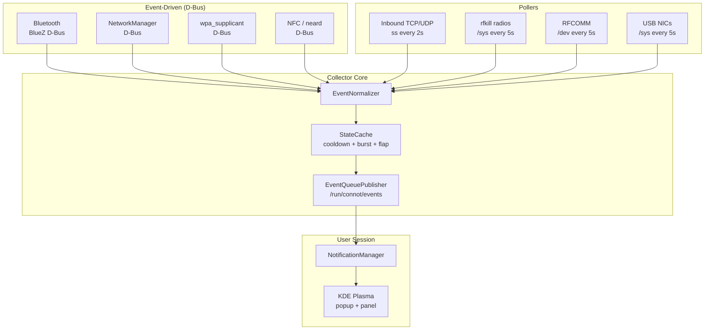

# ConnNotify Architecture

## Overview

ConnNotify now uses two cooperating processes:

- **Collector** (`connot_daemon.py`) runs as root and uses a **GLib main loop** with event-driven monitors and pollers
- **Notifier** (`connot_notifier.py`) runs in the user session and forwards queued events to KDE

The collector performs **Normalize → Deduplicate → Queue**, and the notifier performs **Read queue → Notify**.

- **Event-driven** (D-Bus signals) — zero-latency, no polling
- **Pollers** — periodic checks at 2–5 second intervals

All events flow through a unified pipeline: **Normalize → Deduplicate → Annotate delivery → Queue → Notify**.

## Diagram



## Monitors

| Monitor | Source | Method | Interval | File Reference |
|---|---|---|---|---|
| Bluetooth | BlueZ `org.bluez` | D-Bus signals (`InterfacesAdded`, `PropertiesChanged`) | event-driven | `connot_daemon.py` |
| NetworkManager | `org.freedesktop.NetworkManager` | D-Bus signals (`DeviceAdded`, `StateChanged`, `PropertiesChanged`) | event-driven | `connot_daemon.py` |
| wpa_supplicant | `fi.w1.wpa_supplicant1` | D-Bus signals (`StateChanged`, `PropertiesChanged`) | event-driven | `connot_daemon.py` |
| NFC | neard `org.neard` | D-Bus signals (`InterfacesAdded/Removed`) | event-driven | `connot_daemon.py` |
| Inbound TCP/UDP | `ss -Htnup` / `ss -Hltnup` | subprocess polling with process metadata | 2s | `connot_daemon.py` |
| rfkill radios | `/sys/class/rfkill/` | sysfs polling | 5s | `connot_daemon.py` |
| RFCOMM | `/dev/rfcomm*` | glob polling | 5s | `connot_daemon.py` |
| USB NICs | `/sys/class/net/*/device` | sysfs polling | 5s | `connot_daemon.py` |

## Anti-Spam Pipeline

```
Event → Cooldown check → Flap damping → Burst aggregation → Notification
```

| Mechanism | Description | Config |
|---|---|---|
| **Warmup** | 10s baseline at startup — no notifications for existing state | `WARMUP_SECONDS = 10` |
| **Cooldowns** | Per-source minimum interval between repeated notifications | BT: 30s, Ethernet: 5s, Wi-Fi: 15s, Socket: 60s, rfkill: 10s |
| **Flap damping** | Suppresses after 3+ toggles of the same key within 60s | `FLAP_COUNT = 3`, `FLAP_WINDOW = 60s` |
| **Burst aggregation** | >3 socket events in 3s merged into one summary notification | `BURST_THRESHOLD = 3`, `BURST_WINDOW = 3s` |
| **Noise filter** | Loopback, link-local, mDNS (5353), LLMNR (5355), SSDP (1900), NBNS (137), DHCP (67/68) | `NOISY_UDP_PORTS` |

## Notification Path

1. Collector writes one JSON event per file into `/run/connot/events`
2. User notifier polls that directory
3. Collector-provided delivery metadata marks events as `persistent` or `transient`
4. Primary desktop notification backend: `notify-send -a "ConnNotify" -i <icon> "<title>" "<body>"`
5. Fallback: `kdialog --passivepopup`

## KDE Delivery Policy

Persistent events are intended to remain visible in KDE history:

- socket burst summaries
- Bluetooth connect/disconnect and device appearance/removal
- rfkill state changes
- RFCOMM add/remove
- USB NIC add/remove

Transient events are intended to show as popups without cluttering the history:

- individual socket connection events
- Bluetooth RSSI proximity updates
- NetworkManager property/state churn
- wpa_supplicant state churn
- NFC property chatter

The notifier maps this policy to `notify-send` arguments such as urgency, timeout, category, and `--transient`.

## Queue Semantics

- queue location: `/run/connot/events`
- format: one JSON file per normalized event
- startup behavior: notifier baselines existing files and only delivers newer ones
- pruning: collector periodically removes stale queue files and bounds queue growth

This design avoids replaying old notifications after restart while keeping the collector and notifier loosely coupled.

## Files

| File | Role |
|---|---|
| `connot_daemon.py` | Python 3 root collector — monitors, event pipeline, event queue writer |
| `connot_notifier.py` | Python 3 user notifier — queue reader and KDE notification sender |
| `connot.sh` | Bash launcher for the notifier only |
| `connot-collector.service` | systemd system service unit |
| `connot.service` | systemd user service unit |
| `install.sh` | Installer for both services |
