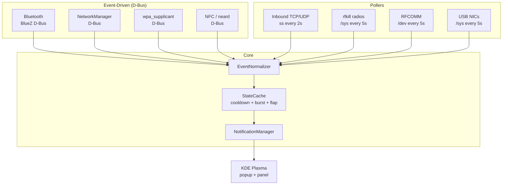

# ConnNotify Architecture

## Overview

The daemon uses a **GLib main loop** with two categories of monitors:

- **Event-driven** (D-Bus signals) — zero-latency, no polling
- **Pollers** — periodic checks at 2–5 second intervals

All events flow through a unified pipeline: **Normalize → Deduplicate → Notify**.

## Diagram



## Monitors

| Monitor | Source | Method | Interval | File Reference |
|---|---|---|---|---|
| Bluetooth | BlueZ `org.bluez` | D-Bus signals (`InterfacesAdded`, `PropertiesChanged`) | event-driven | `connot_daemon.py` L258–328 |
| NetworkManager | `org.freedesktop.NetworkManager` | D-Bus signals (`DeviceAdded`, `StateChanged`, `PropertiesChanged`) | event-driven | `connot_daemon.py` L332–410 |
| wpa_supplicant | `fi.w1.wpa_supplicant1` | D-Bus signals (`StateChanged`, `PropertiesChanged`) | event-driven | `connot_daemon.py` L414–453 |
| NFC | neard `org.neard` | D-Bus signals (`InterfacesAdded/Removed`) | event-driven | `connot_daemon.py` L457–505 |
| Inbound TCP/UDP | `ss -Htnu` / `ss -Hltnu` | subprocess polling | 2s | `connot_daemon.py` L509–593 |
| rfkill radios | `/sys/class/rfkill/` | sysfs polling | 5s | `connot_daemon.py` L597–640 |
| RFCOMM | `/dev/rfcomm*` | glob polling | 5s | `connot_daemon.py` L644–673 |
| USB NICs | `/sys/class/net/*/device` | sysfs polling | 5s | `connot_daemon.py` L677–720 |

## Anti-Spam Pipeline

```
Event → Cooldown check → Flap damping → Burst aggregation → Notification
```

| Mechanism | Description | Config |
|---|---|---|
| **Warmup** | 10s baseline at startup — no notifications for existing state | `WARMUP_SECONDS = 10` |
| **Cooldowns** | Per-source minimum interval between repeated notifications | BT: 30s, Ethernet: 5s, Wi-Fi: 15s, Socket: 60s, rfkill: 10s |
| **Flap damping** | Suppresses after 3+ toggles of the same key within 60s | `FLAP_COUNT = 3`, `FLAP_WINDOW = 60s` |
| **Burst aggregation** | >3 socket events in 3s merged into one summary notification | `BURST_THRESHOLD = 3`, `BURST_WINDOW = 3s` |
| **Noise filter** | Loopback, link-local, mDNS (5353), LLMNR (5355), SSDP (1900), NBNS (137), DHCP (67/68) | `NOISY_UDP_PORTS` |

## Notification Path

1. Primary: `notify-send -a "ConnNotify" -i <icon> "<title>" "<body>"`
2. Fallback: `kdialog --passivepopup` (if notify-send unavailable)

## Files

| File | Role |
|---|---|
| `connot_daemon.py` | Python 3 daemon — monitors, event pipeline, notifications |
| `connot.sh` | Bash launcher — lifecycle management, single-instance lock |
| `connot.service` | systemd user service unit |
| `install.sh` | Installer for the systemd service |
